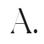

<!-- PROJECT LOGO -->
 

  

  <h3 align="center">Personal Portfolio</h3>

  

    My self coded personal website.
     
     
    <a href="https://julianapraxedes.com/">Live Website</a>
  

<!-- ABOUT THE PROJECT -->
## About The Project

### Built With

* [Github Pages](https://pages.github.com/)
* [fullPage.js](https://alvarotrigo.com/fullPage/)

<!-- Resources -->
## Resources

* Icons by [ionicons](https://ionic.io/ionicons)

(<a href="#top">back to top</a>)

